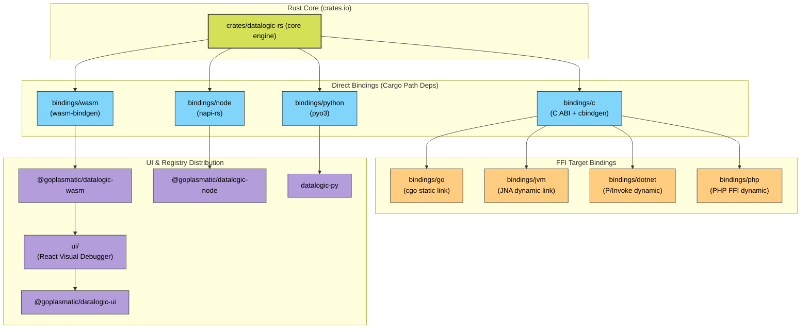
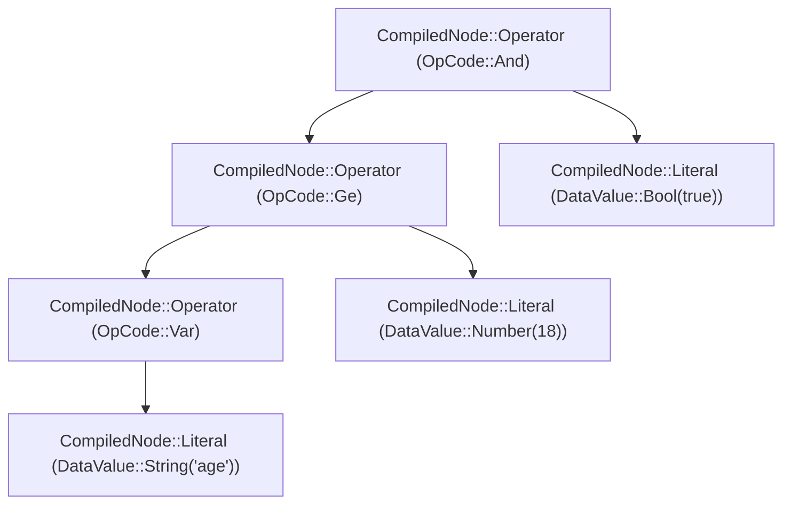

# Architecture

This monorepo ships one logical product — a JSONLogic engine — across
multiple runtime targets that all wrap the same Rust core:



The Rust core is the source of truth for behaviour. Each binding is a
thin FFI shell that converts at the language boundary and re-exposes
the engine. WASM, Node, Python, and C pin the core via Cargo path-deps;
Go, JVM, .NET, and PHP all link against `bindings/c`'s artifacts (Go
statically via `.a`; JVM/.NET/PHP dynamically via `.so` / `.dylib` /
`.dll`). The React UI (`ui/`) consumes the published WASM (or a
locally-linked build) and adds editing, visualisation, and trace
inspection on top.

Two JS-side packages, one engine: **`@goplasmatic/datalogic-node`**
(napi-rs, per-platform `.node` prebuilds) is the first-class target for
Node services. **`@goplasmatic/datalogic-wasm`** (WASM) is the right pick
for browsers, Deno, Bun, Cloudflare Workers, and any context where one
artifact across runtimes beats per-platform prebuilds.

## Cargo workspace layout

The repo root holds a Cargo workspace with two members:

- `crates/datalogic-rs` — the published crate, `datalogic-rs`.
- `tools/benchmark` — dev-only binaries (`self`, `compare`), `publish = false`.

Each Rust-side binding (`bindings/wasm`, `bindings/node`,
`bindings/python`, `bindings/c`) declares its own `[workspace]` table
and is excluded from the parent workspace. The non-Rust bindings
(`bindings/jvm`, `bindings/dotnet`, `bindings/php`, `bindings/go`) are
not Cargo crates at all — they're Maven / .NET / Composer / Go modules
that consume the artifacts from `bindings/c`. This is deliberate:

- **`bindings/wasm`** — `wasm-pack` needs the WASM-specific release
  profile (`opt-level = "z"`, `lto = true`, `panic = "abort"`,
  `strip = true`), and Cargo only honours `[profile.*]` at a workspace
  root.
- **`bindings/node`** — keeps the napi-rs build deps + `cdylib` codegen
  out of the default `cargo test --workspace --all-features` path so
  contributors don't need Node toolchain to run core tests.
- **`bindings/python`** — keeps the pyo3 build deps + `cdylib` codegen
  out of the default `cargo test --workspace --all-features` path so
  contributors don't need a Python interpreter to run core tests.
- **`bindings/c`** — same reasoning: keeps cbindgen + `cdylib`/`staticlib`
  outputs separate from the core test loop.

`bindings/go` is a Go module (no Cargo manifest); it links the static
library produced by `bindings/c`. `bindings/jvm`, `bindings/dotnet`,
and `bindings/php` are Maven / .NET / Composer packages that load the
**dynamic** library produced by `bindings/c` at runtime — they don't
participate in the Rust build graph at all. `ui` is a Node package.
Cargo ignores them all.

## Two-phase evaluation (in `crates/datalogic-rs`)

1. **Compile** — `Engine::compile` parses JSON logic into a `Logic` tree.
   String operator names are resolved to an `OpCode` enum so dispatch at
   eval time is a `match` on a `u8`-sized discriminant. Constant
   sub-expressions are folded; dead branches are elided.
2. **Evaluate** — `Engine::evaluate` walks the compiled tree against an
   input `&DataValue`. Results are `&'a DataValue<'a>` allocated in a
   caller-supplied `bumpalo::Bump` arena. Read-through ops like `var`
   borrow zero-copy directly from the input; arithmetic and reductions
   allocate into the arena.

For high-throughput callers, `Engine::session()` returns a `Session` that
owns a reusable arena and resets it between calls — peak memory tracks the
largest single evaluation, not the sum.

`Logic` is `Send + Sync` and wrapped in `Arc` internally, so a compiled
rule can be shared across threads with no extra setup.

## Feature flags and where they apply

Features are declared on `datalogic-rs` (the core crate). Other crates
opt in via their dependency line.

| Feature           | Effect                                                            | Used by                        |
|-------------------|-------------------------------------------------------------------|--------------------------------|
| `serde_json`      | `&serde_json::Value` interop + `eval_into::<T>` typed output      | Node, Python, C, `benchmark`, integration tests |
| `templating`      | Structure-preservation (templating) mode                          | WASM, Node, Python, C (Go/JVM/.NET/PHP inherit), examples |
| `datetime`        | Date/time operators (pulls in `chrono`)                           | WASM, Node, Python, C, `datetime_ops` example |
| `trace`           | Execution-step recording for the debugger (implies `serde_json`)  | WASM, Node, Python, C (Go/JVM/.NET/PHP inherit), `tracing` example |
| `error-handling`  | `try` / `throw` operators                                         | WASM, Node, Python, C, `error_handling` example |
| `ext-string`, `ext-array`, `ext-control`, `ext-math` | Optional operator families                 | WASM, Node, Python, C; opt-in per Rust consumer |
| `flagd`           | `fractional` + `sem_ver` operators (OpenFeature flagd spec); pulls in `semver` | WASM, Node, Python, C (Go/JVM/.NET/PHP inherit). See [flagd docs](https://flagd.dev/reference/custom-operations/) |

The non-Rust bindings (Go, JVM, .NET, PHP) inherit whatever feature set
`bindings/c` is compiled with — they don't have their own Cargo
manifest. To turn an operator family on or off for those bindings, edit
`bindings/c/Cargo.toml` and rebuild the cdylib.

The `datalogic-bench` crate enables `serde_json` because it reads the
JSON test-suite files via `serde_json::Value`; it does not need
`templating`.

## Where things live

| Concern                        | Path                                              |
|--------------------------------|---------------------------------------------------|
| Public Rust API                | `crates/datalogic-rs/src/lib.rs`                  |
| Engine + dispatcher            | `crates/datalogic-rs/src/engine/`                 |
| Compile pipeline + optimiser   | `crates/datalogic-rs/src/compile/`                |
| OpCode enum (59 builtins)      | `crates/datalogic-rs/src/opcode.rs`               |
| Operator implementations       | `crates/datalogic-rs/src/operators/`              |
| Arena value types & context    | `crates/datalogic-rs/src/arena/`                  |
| Rust integration tests         | `crates/datalogic-rs/tests/`                      |
| JSONLogic JSON test suites     | `crates/datalogic-rs/tests/suites/`               |
| Executable examples            | `crates/datalogic-rs/examples/`                   |
| WASM FFI surface               | `bindings/wasm/src/lib.rs`                        |
| WASM build script              | `bindings/wasm/build.sh`                          |
| Node native FFI (napi-rs)      | `bindings/node/src/lib.rs`                        |
| Python FFI (pyo3)              | `bindings/python/src/lib.rs`                      |
| C ABI (extern "C" + cbindgen)  | `bindings/c/src/`, generated header in `bindings/c/include/datalogic.h` |
| Go binding (cgo over C ABI)    | `bindings/go/`                                    |
| JVM binding (JNA over C ABI)   | `bindings/jvm/`                                   |
| .NET binding (P/Invoke over C ABI) | `bindings/dotnet/`                            |
| PHP binding (PHP FFI over C ABI) | `bindings/php/`                                 |
| React editor + debugger        | `ui/src/components/logic-editor/`                 |
| Benchmark harness              | `tools/benchmark/src/`                            |

For day-to-day commands (build, test, run, link), see [DEVELOPMENT.md](./DEVELOPMENT.md).

## Compile-time optimizations

The compile pipeline (`crates/datalogic-rs/src/compile/optimize/`) runs three
passes to a fixpoint: constant folding, dead-code elimination, and
strength reduction. Each pass is a pure tree transform with its own
test suite, and adding another is a matter of dropping a file in the
directory and registering it from `optimize/mod.rs`.

### What runs today

| Pass             | What it does                                                          | Where                     |
|------------------|-----------------------------------------------------------------------|---------------------------|
| `constant_fold`  | Pre-evaluates subtrees with no `Var` / `Missing` dependency           | `optimize/constant_fold.rs` |
| `dead_code`      | Elides unreachable arms (`if` with constant condition, etc.)          | `optimize/dead_code.rs`     |
| `strength`       | Strength reduction (`{"+": [x]}` → `x`, `{"*": [x]}` → `x`)           | `optimize/strength.rs`      |

The runtime side has its own fast paths that don't need a compile-time
pass to fire — notably:

- `FastPredicate::from_node` in array operators detects predicate
  shapes that can run without pushing a context frame per item.
- `filter_strict_eq_field_fast_path` recognises
  `filter(arr, == [{var: "field"}, invariant])` and evaluates the
  invariant once outside the loop.
- `evaluate_invariant_no_push` short-circuits any predicate-side node
  that doesn't reference the iteration scope.
- `dispatch_node` (`crates/datalogic-rs/src/engine/mod.rs`) carries a
  literal fast path: trivial `Value` nodes (`Null`, `Bool`, numbers,
  empty primitives) return their precomputed `&'static DataValue<'static>`
  directly without entering the dispatch match.

### Deferred work

Optimizations the team has discussed but not built. Captured here so
future contributors don't redo the analysis.

#### Compile-time predicate hoisting in filter / map / reduce

Today, loop-invariant detection in array operators happens at runtime
via the helpers above and only catches specific shapes (the strict-eq
fast path; literal/parent-scope-var leaves). A general compile-time
pass would walk the predicate of any iterating op, identify
sub-expressions that don't reference the current iteration scope (no
`scope_level == 0` `Var`, no nested iterating frames), and rewrite the
tree so those subtrees evaluate once before the loop and the result
is fed in as a literal.

**Why deferred.** The runtime fast paths cover the dominant shapes the
benchmark suite hits today (equality filters, "field equals
constant"). Building a general hoisting pass would mean: a free-variable
analysis on `CompiledNode` (cheap), a rewrite that introduces let-bound
nodes or pre-evaluation slots (changes the node taxonomy), and a
correctness story for predicates that reference outer iteration scopes
(`scope_level > 0`). Worth doing once a perf profile shows non-trivial
time spent re-evaluating an invariant subtree per iteration in a real
workload.

#### Single-operator-tree inlining beyond literals

The literal fast path skips dispatch for `Null` / `Bool` / numbers /
empty primitives. A natural extension: when the entire compiled tree
is a single `Var` (the dominant template-rule shape), let
`Engine::evaluate` short-circuit to `evaluate_val_compiled` directly
without the `dispatch_node` wrapper.

**Why deferred.** Saves one match dispatch (~1 ns on the 15 ns
baseline). Detectable as a single-operator program at compile time,
but the win is small and the code path adds a special case that the
trace-collector and breadcrumb code would need to learn about.
Postponed until a workload shows the dispatch overhead matters.

#### Reduce-output sizing hints

`reduce` allocates a `bumpalo::Vec` for each accumulator-typed result.
For numeric / bool accumulators the vec capacity isn't useful — but
for array-output reductions the input length is a known upper bound
on the output. A `metadata_hint` on the compiled `Reduce` node could
carry this and let the runtime pre-size.

**Why deferred.** Speculative — no benchmark currently shows reduce
allocation as a hotspot, and the wins compound only for accumulators
that build composite values. Picked as the third item only because it
came up in design discussion; deprioritise unless evidence appears.

## Memory Boundaries & Data Serialization

Since `datalogic-rs` utilizes `bumpalo` for arena allocation and outputs zero-copy borrowed `&DataValue<'a>` values, crossing language FFI boundaries requires clear memory and serialization strategies:

### 1. The JavaScript/WASM Boundary (`@goplasmatic/datalogic-wasm`)
- **Lifecycle:** JavaScript objects are serialized into JSON strings before passing to Rust. Rust compiles, evaluates, and serializes the result back to a JSON string.
- **Memory:** Memory allocated in WebAssembly is isolated. The WASM binding manages its own internal buffers, copying string contents across the boundary.

### 2. The Node Native Boundary (`@goplasmatic/datalogic-node`)
- **Lifecycle:** Reaches native C-like speed via N-API. JavaScript values are converted directly into napi values without mandatory string allocation where possible, though string-based payloads remain the default fallback for complex objects.

### 3. The C ABI Boundary (`bindings/c`)
- **Lifecycle:** The C ABI accepts C-style null-terminated strings (`*const c_char`) representing JSON payloads.
- **Memory Ownership:** 
  - Compilation allocates `Logic` on the Rust heap and returns a raw pointer (`*mut Logic`).
  - Evaluations happen within transient or session-scoped boundaries.
  - **Crucial:** Consumers (Go, JVM, .NET, PHP) must explicitly release this heap memory by calling `datalogic_free_logic(ptr)` to avoid memory leaks.

## AST Compilation Flow

A simple diagram mapping a JSONLogic rule to the internal `CompiledNode` tree helps contributors understand how the compilation phase optimizes dispatch:

### Compilation Transformation

**JSON Rule:**
```json
{
  "and": [
    { ">=": [{ "var": "age" }, 18] },
    true
  ]
}
```

**Compiled AST representation (`CompiledNode`):**



- String lookups (like `"and"` and `">="`) are resolved into `OpCode` variants during compilation, allowing evaluation to use `O(1)` enum dispatch rather than string hashing.
- Constant folding passes automatically simplify subtrees like `{"and": [true, true]}` into a single literal value before evaluation starts.

