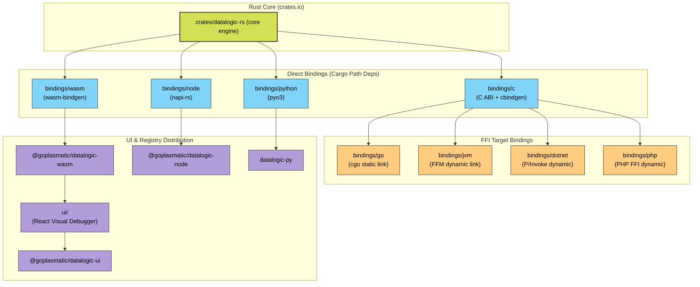
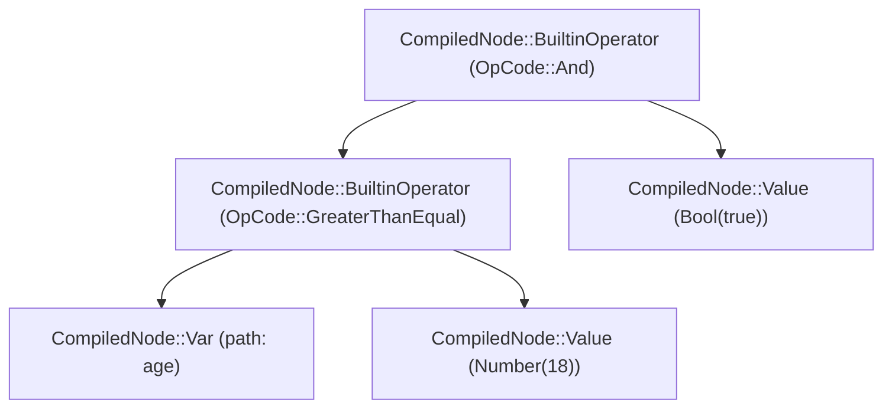

# Architecture

This monorepo ships one logical product, a JSONLogic engine, across
multiple runtime targets that all wrap the same Rust core:


```mermaid
graph TD
    %% Core Engine
    subgraph Core ["Rust Core (crates.io)"]
        Engine["crates/datalogic-rs (core engine)"]
    end

    %% Direct Bindings
    subgraph Direct ["Direct Bindings (Cargo Path Deps)"]
        WASM["bindings/wasm <br> (wasm-bindgen)"]
        Node["bindings/node <br> (napi-rs)"]
        Python["bindings/python <br> (pyo3)"]
        C_FFI["bindings/c <br> (C ABI + cbindgen)"]
    end

    %% FFI Consumers
    subgraph Consumers ["FFI Target Bindings"]
        Go["bindings/go <br> (cgo static link)"]
        JVM["bindings/jvm <br> (FFM dynamic link)"]
        DotNet["bindings/dotnet <br> (P/Invoke dynamic)"]
        PHP["bindings/php <br> (PHP FFI dynamic)"]
    end

    %% Ecosystem / UI
    subgraph UI_Ecosystem ["UI & Registry Distribution"]
        UI["ui/ <br> (React Visual Debugger)"]
        NPM_WASM["@goplasmatic/datalogic-wasm"]
        NPM_NODE["@goplasmatic/datalogic-node"]
        PyPI["datalogic-py"]
        NPM_UI["@goplasmatic/datalogic-ui"]
    end

    %% Relationships
    Engine --> WASM
    Engine --> Node
    Engine --> Python
    Engine --> C_FFI
    
    C_FFI --> Go
    C_FFI --> JVM
    C_FFI --> DotNet
    C_FFI --> PHP

    WASM --> NPM_WASM
    Node --> NPM_NODE
    Python --> PyPI
    
    NPM_WASM --> UI
    UI --> NPM_UI
    
    classDef core fill:#d4e157,stroke:#333,stroke-width:2px,color:#000;
    classDef binding fill:#81d4fa,stroke:#333,stroke-width:1px,color:#000;
    classDef consumer fill:#ffcc80,stroke:#333,stroke-width:1px,color:#000;
    classDef ui fill:#b39ddb,stroke:#333,stroke-width:1px,color:#000;
    
    class Engine core;
    class WASM,Node,Python,C_FFI binding;
    class Go,JVM,DotNet,PHP consumer;
    class UI,NPM_WASM,NPM_NODE,PyPI,NPM_UI ui;
```

The Rust core is the source of truth for behaviour. Each binding is a
thin FFI shell that converts at the language boundary and re-exposes
the engine. WASM, Node, Python, and C pin the core via Cargo path-deps;
Go, JVM, .NET, and PHP all link against `bindings/c`'s artifacts (Go
statically via `.a`; JVM/.NET/PHP dynamically via `.so` / `.dylib` /
`.dll`). The React UI (`ui/`) consumes the WASM package vendored from
`bindings/wasm/pkg` (its npm lifecycle hooks copy the local build into
`ui/vendor/datalogic`) and adds editing, visualisation, and trace
inspection on top.

The repo ships two JS-side packages over the same engine.
**`@goplasmatic/datalogic-node`** (napi-rs, per-platform `.node`
prebuilds) is the primary target for Node services.
**`@goplasmatic/datalogic-wasm`** (WASM) targets browsers, Deno, Bun,
Cloudflare Workers, and any context where one artifact across runtimes
beats per-platform prebuilds.

## Cargo workspace layout

The repo root holds a Cargo workspace with two members:

- `crates/datalogic-rs`: the published crate, `datalogic-rs`.
- `tools/benchmark` (dev-only, `publish = false`): `self`
  (single-engine regression baseline), `compare` (cross-library matrix),
  `boundary_core` (rust-core runner for the per-binding boundary
  benchmark), `profile_macro` (hot-loop feeder for sampling profilers).

Each Rust-side binding (`bindings/wasm`, `bindings/node`,
`bindings/python`, `bindings/c`) declares its own `[workspace]` table
and is excluded from the parent workspace. The non-Rust bindings
(`bindings/jvm`, `bindings/dotnet`, `bindings/php`, `bindings/go`) are
not Cargo crates; they're Maven / .NET / Composer / Go modules
that consume the artifacts from `bindings/c`. This is deliberate:

- **`bindings/wasm`**: `wasm-pack` needs the WASM-specific release
  profile (`opt-level = "z"`, `lto = true`, `panic = "abort"`,
  `strip = true`), and Cargo only honours `[profile.*]` at a workspace
  root.
- **`bindings/node`**: keeps the napi-rs build deps + `cdylib` codegen
  out of the default `cargo test --workspace --all-features` path so
  contributors don't need Node toolchain to run core tests.
- **`bindings/python`**: keeps the pyo3 build deps + `cdylib` codegen
  out of the default `cargo test --workspace --all-features` path so
  contributors don't need a Python interpreter to run core tests.
- **`bindings/c`**: same reasoning; keeps cbindgen + `cdylib`/`staticlib`
  outputs separate from the core test loop.

`bindings/go` is a Go module (no Cargo manifest); it links the static
library produced by `bindings/c`. `bindings/jvm`, `bindings/dotnet`,
and `bindings/php` are Maven / .NET / Composer packages that load the
**dynamic** library produced by `bindings/c` at runtime; they don't
participate in the Rust build graph. `ui` is a Node package.
Cargo ignores them all.

## Two-phase evaluation (in `crates/datalogic-rs`)

1. **Compile**: `Engine::compile` parses JSON logic into a `Logic` tree.
   It resolves string operator names to an `OpCode` enum so dispatch at
   eval time is a `match` on a `u8`-sized discriminant, folds constant
   sub-expressions, and elides dead branches.
2. **Evaluate**: `Engine::evaluate` walks the compiled tree against an
   input `&DataValue`. Results are `&'a DataValue<'a>` allocated in a
   caller-supplied `bumpalo::Bump` arena. Read-through ops like `var`
   borrow zero-copy directly from the input; arithmetic and reductions
   allocate into the arena.

For high-throughput callers, `Engine::session()` returns a `Session` that
owns a reusable arena; the caller calls `Session::reset()` (O(1)) between
iterations so peak memory tracks the largest single evaluation, not the
sum. The session never resets on its own.

`Logic` is `Send + Sync` and wrapped in `Arc` internally, so you can
share a compiled rule across threads with no extra setup.

## Feature flags and where they apply

Features are declared on `datalogic-rs` (the core crate). Other crates
opt in via their dependency line.

| Feature           | Effect                                                            | Used by                        |
|-------------------|-------------------------------------------------------------------|--------------------------------|
| `serde_json`      | `&serde_json::Value` interop + `eval_into::<T>` typed output      | Node, Python, C, `benchmark`, integration tests |
| `templating`      | Structure-preservation (templating) mode, plus the optional `with_template_key_escape(char)` prefix that lets an operator-named key be emitted as an output field | WASM, Node, Python, C (Go/JVM/.NET/PHP inherit), examples |
| `datetime`        | Date/time operators (pulls in `chrono` + `chrono-tz` for the IANA-zone arguments on `format_date`/`parse_date`) | WASM, Node, Python, C, `datetime_ops` example |
| `trace`           | Execution-step recording for the debugger (implies `serde_json`)  | WASM, Node, Python, C (Go/JVM/.NET/PHP inherit), `tracing` example |
| `error-handling`  | `try` / `throw` operators                                         | WASM, Node, Python, C, `error_handling` example |
| `ext-string`, `ext-array`, `ext-object`, `ext-control`, `ext-math` | Optional operator families | WASM, Node, Python, C; opt-in per Rust consumer |
| `flagd`           | `fractional` + `sem_ver` operators (OpenFeature flagd spec); pulls in `semver` | WASM, Node, Python, C (Go/JVM/.NET/PHP inherit). See [flagd docs](https://flagd.dev/reference/custom-operations/) |
| `wasm-clock`      | JS-host clock for `now` on `wasm32-unknown-unknown` (forwards to `chrono/wasmbind`). Deliberately opt-in: it links JS imports that non-JS wasm runtimes (wasmtime, wazero, Chicory) cannot satisfy (issue #47) | WASM only. Never enable when the module runs outside a JS host |
| `tensor`          | datavalue's `Tensor` value (dtype + shape + row-major byte buffer) and 20 marshalling-only operators over it. Arithmetic-free by design: every operator's cost is proportional to the data it moves, which is what lets `budget` price it honestly. No new dependency; crosses JSON as the tagged `{"tensor": {..}}` form, so the text-returning bindings carry it with no FFI change | WASM, Node, Python, C (Go/JVM/.NET/PHP inherit), `benchmark` |
| `tensor-half`     | Lifts the `f16` / `bf16` restriction on the element-wise tensor operators (the byte-moving ones already work on every dtype). Pulls in `half` through datavalue | Opt-in per Rust consumer; not enabled in any binding |
| `budget`          | Per-evaluation operation counter with a hard abort: `EvaluationConfig::ops_budget`, `Engine::evaluate_metered` / `Session::eval_metered`, `EvalContext::charge`, and `ErrorKind::BudgetExceeded`. Costs ~3.6% geomean when compiled in and unset (22.75 -> 23.56 ns/op on the self benchmark), which is why it is a flag | WASM, Node, Python, C (Go/JVM/.NET/PHP inherit) |

The non-Rust bindings (Go, JVM, .NET, PHP) inherit whatever feature set
`bindings/c` is compiled with, since they don't have their own Cargo
manifest. To turn an operator family on or off for those bindings, edit
`bindings/c/Cargo.toml` and rebuild the cdylib.

The `datalogic-bench` crate enables `serde_json` because it reads the
JSON test-suite files via `serde_json::Value`; it does not need
`templating`.

## Where things live

| Concern                        | Path                                              |
|--------------------------------|---------------------------------------------------|
| Public Rust API                | `crates/datalogic-rs/src/lib.rs`                  |
| Engine + dispatcher            | `crates/datalogic-rs/src/engine/`                 |
| Compile pipeline + optimiser   | `crates/datalogic-rs/src/compile/`                |
| OpCode enum (64 builtins; 67 accepted names including the `var` / `?:` / `match` aliases) | `crates/datalogic-rs/src/opcode.rs` |
| Operator implementations       | `crates/datalogic-rs/src/operators/`              |
| Arena value types & context    | `crates/datalogic-rs/src/arena/`                  |
| Rust integration tests         | `crates/datalogic-rs/tests/`                      |
| JSONLogic JSON test suites     | `crates/datalogic-rs/tests/suites/`               |
| Executable examples            | `crates/datalogic-rs/examples/`                   |
| WASM FFI surface               | `bindings/wasm/src/lib.rs`                        |
| WASM build script              | `bindings/wasm/build.sh`                          |
| Node native FFI (napi-rs)      | `bindings/node/src/lib.rs`                        |
| Python FFI (pyo3)              | `bindings/python/src/lib.rs`                      |
| C ABI (extern "C" + cbindgen)  | `bindings/c/src/`, generated header in `bindings/c/include/datalogic.h` |
| Go binding (cgo over C ABI)    | `bindings/go/`                                    |
| JVM binding (FFM over C ABI)   | `bindings/jvm/`                                   |
| .NET binding (P/Invoke over C ABI) | `bindings/dotnet/`                            |
| PHP binding (PHP FFI over C ABI) | `bindings/php/`                                 |
| React editor + debugger        | `ui/src/components/logic-editor/`                 |
| Benchmark harness              | `tools/benchmark/src/`                            |

For day-to-day commands (build, test, run, link), see [DEVELOPMENT.md](./DEVELOPMENT.md).

## Compile-time optimizations

The compile pipeline (`crates/datalogic-rs/src/compile/optimize/`) runs a
fixpoint loop over three per-node passes (dead-code elimination, constant
folding, strength reduction; each iteration ends with a second dead-code
sweep so shapes exposed by strength reduction are cleaned up in the same
round), then one whole-tree common-subexpression-elimination pass over
the finished tree. Each pass is a pure tree transform with its own test
suite; to add another, drop a file in the directory and register it
from `optimize/mod.rs`.

### What runs today

| Pass             | What it does                                                          | Where                     |
|------------------|-----------------------------------------------------------------------|---------------------------|
| `constant_fold`  | Pre-evaluates subtrees with no `Var` / `Missing` dependency           | `optimize/constant_fold.rs` |
| `dead_code`      | Elides unreachable arms (`if` with constant condition, etc.)          | `optimize/dead_code.rs`     |
| `strength`       | Strength reduction (`{"+": [x]}` → `x`, `{"*": [x]}` → `x`)           | `optimize/strength.rs`      |
| `cse`            | Memoizes structurally identical pure subtrees into per-evaluation slots (`Logic::cse_slot_count()`); never memoizes custom operators, `try` / `throw`, `now`, `fractional`, `sem_ver`, or the per-item bodies of iterating operators. Runs once after the fixpoint loop. | `optimize/cse.rs`           |
| `scope`          | Resolves every `var` / `val` / `exists` reference to a compile-time `ScopeBinding` (`Root` / `Current` / `Ancestor`), so the runtime reads a precomputed frame target instead of probing `ctx.depth()`. Runs once after CSE; unconditional, so no-fold and traced compiles get the same resolution. | `compile/scope.rs`          |
| `scope` (cont.)  | The same pass reports `Logic::needs_ancestor_frames`: whether any reference can reach past the innermost frame. When false (the common case: reaching an ancestor takes both two levels of iterator nesting and a level marker inside the inner one) evaluation skips maintaining the ancestor-frame list entirely. | `compile/scope.rs`          |

`compile/scope.rs` also owns `frames_pushed_for_child`, the single source
of truth for which argument positions execute under a pushed context frame
(iterator bodies, sort/group_by/distinct key expressions, a multi-arg `try`'s
catch arm). Both the scope pass and `optimize/cse.rs` read it, so the two can
never drift. **An operator that pushes a frame must register its argument
position there**, or variable references beneath it resolve against the wrong
frame; a debug-only oracle in `operators::variable` cross-checks every
resolution against the runtime walk and fires on the first test that
exercises an omission.

The runtime side has its own fast paths that fire without a compile-time
pass, including:

- `FastPredicate::from_node` in array operators detects predicate
  shapes that can run without pushing a context frame per item.
- `filter_strict_eq_field_fast_path` recognises
  `filter(arr, == [{var: "field"}, invariant])` and evaluates the
  invariant once outside the loop.
- `is_filter_invariant` admits only literals and root-bound references
  to that hoist, since neither reads the frame stack the fast path
  skips.
- `dispatch_node` (`crates/datalogic-rs/src/engine/mod.rs`) carries a
  literal fast path: every `CompiledNode::Value` reachable from a `Logic`
  carries a pre-built `PreLit` view (trivial values from `precompute_lit`
  at node construction, composite arrays and objects from the
  `populate_lits` pass), so a literal returns a borrow without entering
  the dispatch match. Only synthetic nodes built outside the compile
  pipeline fall back to per-call arena conversion.

### Deferred work

The team has discussed these optimizations but not built them. They are
recorded here so future contributors don't redo the analysis.

#### Compile-time predicate hoisting in filter / map / reduce

Today, loop-invariant detection in array operators happens at runtime
via the helpers above and only catches specific shapes (the strict-eq
fast path; literal/parent-scope-var leaves). A general compile-time
pass would walk the predicate of any iterating op, identify
sub-expressions that don't reference the current iteration scope (no
`scope_level == 0` `Var`, no nested iterating frames), and rewrite the
tree so those subtrees evaluate once before the loop and the result
is fed in as a literal.

**Why deferred.** The runtime fast paths cover the dominant shapes the
benchmark suite hits today (equality filters, "field equals
constant"). Building a general hoisting pass would mean: a free-variable
analysis on `CompiledNode` (cheap), a rewrite that introduces let-bound
nodes or pre-evaluation slots (changes the node taxonomy), and a
correctness story for predicates that reference outer iteration scopes
(`scope_level > 0`). Worth doing once a perf profile shows non-trivial
time spent re-evaluating an invariant subtree per iteration in a real
workload.

#### Single-operator-tree inlining beyond literals

The literal fast path skips dispatch for every pre-built literal,
composites included. A natural extension: when the entire compiled tree
is a single `Var` (the dominant template-rule shape), let
`Engine::evaluate` short-circuit to `evaluate_val_compiled` directly
without the `dispatch_node` wrapper.

**Why deferred.** Saves one match dispatch (~1 ns on the 15 ns
baseline). Detectable as a single-operator program at compile time,
but the win is small and the code path adds a special case that the
trace-collector and breadcrumb code would need to learn about.
Postponed until a workload shows the dispatch overhead matters.

#### Reduce-output sizing hints

`reduce` allocates a `bumpalo::Vec` for each accumulator-typed result.
For numeric / bool accumulators the vec capacity isn't useful, but
for array-output reductions the input length is a known upper bound
on the output. A `metadata_hint` on the compiled `Reduce` node could
carry this and let the runtime pre-size.

**Why deferred.** Speculative: no benchmark currently shows reduce
allocation as a hotspot, and the wins compound only for accumulators
that build composite values. Picked as the third item only because it
came up in design discussion; deprioritise unless evidence appears.

## Memory Boundaries & Data Serialization

Since `datalogic-rs` uses `bumpalo` for arena allocation and outputs zero-copy borrowed `&DataValue<'a>` values, crossing language FFI boundaries requires clear memory and serialization strategies:

### 1. The JavaScript/WASM Boundary (`@goplasmatic/datalogic-wasm`)
- **Lifecycle:** Three tiers. The string tier serializes JavaScript objects into JSON text, copies it into module memory, evaluates, and serializes the result back to a JSON string on every call. The `DataHandle` tier parses a payload once into module memory and evaluates many rules against it with no per-call copy or parse (`evaluateData`). The typed (`evaluateBool` / `evaluateNumber` / `evaluateTruthy`) and batch (`evaluateBatch` / `evaluateMany`) entry points also skip the result stringify, returning primitives or one result array per call.
- **Memory:** Memory allocated in WebAssembly is isolated. The string tier copies bytes across the boundary in both directions; a `DataHandle` keeps its parsed tree resident until `free()`.

### 2. The Node Native Boundary (`@goplasmatic/datalogic-node`)
- **Lifecycle:** Runs native code via N-API, with the same three tiers as WASM: string in / string out through napi strings, a `DataHandle` that parses once and stays resident in native memory (`evaluateData` / `evaluateDataStr`), and typed (`evaluateBool` / `evaluateNumber`) and batch (`evaluateBatch` / `evaluateMany`) entry points that return primitives or arrays without a result stringify.

### 3. The C ABI Boundary (`bindings/c`)
- **Lifecycle:** ABI v2 (`DATALOGIC_ABI_VERSION == 2`; consumers call `datalogic_abi_version()` once at load and abort on a mismatch). Every byte input is a `(pointer, length)` UTF-8 slice, never NUL-terminated. Fallible calls return a `datalogic_status` code and take a trailing `datalogic_error **` out-parameter: pass `NULL` to skip capture, otherwise read the fine-grained engine tag via `datalogic_error_tag` and release the handle with `datalogic_error_free`.
- **Memory Ownership:**
  - Compilation allocates `Logic` on the Rust heap and returns an opaque handle (`datalogic_rule *`); `datalogic_data_parse` returns a `datalogic_data *` handle for the parse-once tier.
  - Session results (`datalogic_session_evaluate*`) are **borrowed**: they point into a session-owned buffer that is valid until the next call touching the same session (any evaluate, reset, or free), so consumers copy before then.
  - One-shot results (`datalogic_engine_apply` and friends) are **owned** `datalogic_buf` values released with `datalogic_buf_free`.
  - **Crucial:** Consumers (Go, JVM, .NET, PHP) must explicitly release each handle with its paired free function: `datalogic_engine_builder_free`, `datalogic_engine_free`, `datalogic_rule_free`, `datalogic_data_free`, `datalogic_session_free`, `datalogic_traced_session_free`, `datalogic_error_free`, plus `datalogic_buf_free` for owned result buffers (see `bindings/c/include/datalogic.h`).

## AST Compilation Flow

The diagram below maps a JSONLogic rule to the internal `CompiledNode` tree and shows how the compilation phase optimizes dispatch:

### Compilation Transformation

**JSON Rule:**
```json
{
  "and": [
    { ">=": [{ "var": "age" }, 18] },
    true
  ]
}
```

**Compiled AST representation (`CompiledNode`):**


```mermaid
graph TD
    Root["CompiledNode::BuiltinOperator (OpCode::And)"]
    Left["CompiledNode::BuiltinOperator (OpCode::GreaterThanEqual)"]
    Right["CompiledNode::Value (Bool(true))"]

    Var["CompiledNode::Var (path: age)"]
    Const18["CompiledNode::Value (Number(18))"]

    Root --> Left
    Root --> Right

    Left --> Var
    Left --> Const18
```

- The compiler resolves string lookups (like `"and"` and `">="`) into `OpCode` variants, so evaluation uses `O(1)` enum dispatch rather than string hashing.
- `var` / `val` with a literal path compiles to a dedicated `CompiledNode::Var` node (`try_compile_var`) whose path segments are pre-split; it is not an operator node with a string-literal child.
- Constant folding only collapses subtrees with no data dependency: `{"and": [true, true]}` becomes a single `Value` before evaluation starts, while the tree above keeps its `Var` and stays dynamic because `age` is only known at evaluation time.

