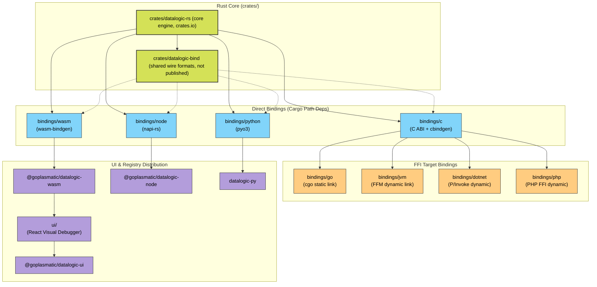
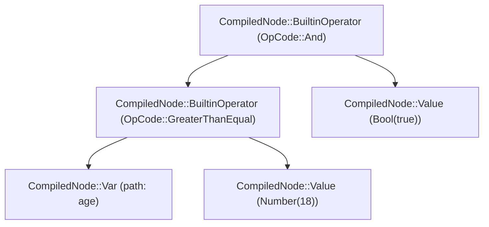

# Architecture

This monorepo ships one logical product, a JSONLogic engine, across
multiple runtime targets that all wrap the same Rust core:


```mermaid
graph TD
    %% Core Engine
    subgraph Core ["Rust Core (crates/)"]
        Engine["crates/datalogic-rs (core engine, crates.io)"]
        Bind["crates/datalogic-bind (shared wire formats, not published)"]
    end

    %% Direct Bindings
    subgraph Direct ["Direct Bindings (Cargo Path Deps)"]
        WASM["bindings/wasm <br> (wasm-bindgen)"]
        Node["bindings/node <br> (napi-rs)"]
        Python["bindings/python <br> (pyo3)"]
        C_FFI["bindings/c <br> (C ABI + cbindgen)"]
    end

    %% FFI Consumers
    subgraph Consumers ["FFI Target Bindings"]
        Go["bindings/go <br> (cgo static link)"]
        JVM["bindings/jvm <br> (FFM dynamic link)"]
        DotNet["bindings/dotnet <br> (P/Invoke dynamic)"]
        PHP["bindings/php <br> (PHP FFI dynamic)"]
    end

    %% Ecosystem / UI
    subgraph UI_Ecosystem ["UI & Registry Distribution"]
        UI["ui/ <br> (React Visual Debugger)"]
        NPM_WASM["@goplasmatic/datalogic-wasm"]
        NPM_NODE["@goplasmatic/datalogic-node"]
        PyPI["datalogic-py"]
        NPM_UI["@goplasmatic/datalogic-ui"]
    end

    %% Relationships
    Engine --> Bind
    Engine --> WASM
    Engine --> Node
    Engine --> Python
    Engine --> C_FFI
    Bind -.-> WASM
    Bind -.-> Node
    Bind -.-> Python
    Bind -.-> C_FFI

    C_FFI --> Go
    C_FFI --> JVM
    C_FFI --> DotNet
    C_FFI --> PHP

    WASM --> NPM_WASM
    Node --> NPM_NODE
    Python --> PyPI
    
    NPM_WASM --> UI
    UI --> NPM_UI
    
    classDef core fill:#d4e157,stroke:#333,stroke-width:2px,color:#000;
    classDef binding fill:#81d4fa,stroke:#333,stroke-width:1px,color:#000;
    classDef consumer fill:#ffcc80,stroke:#333,stroke-width:1px,color:#000;
    classDef ui fill:#b39ddb,stroke:#333,stroke-width:1px,color:#000;
    
    class Engine,Bind core;
    class WASM,Node,Python,C_FFI binding;
    class Go,JVM,DotNet,PHP consumer;
    class UI,NPM_WASM,NPM_NODE,PyPI,NPM_UI ui;
```

The Rust core is the source of truth for behaviour. Each binding is a
thin FFI shell that converts at the language boundary and re-exposes
the engine. WASM, Node, Python, and C pin the core via Cargo path-deps;
Go, JVM, .NET, and PHP all link against `bindings/c`'s artifacts (Go
statically via `.a`; JVM/.NET/PHP dynamically via `.so` / `.dylib` /
`.dll`). The four Rust-side bindings also depend on
`crates/datalogic-bind`, which defines once the JSON documents every
binding emits (the traced-run envelope, the operator catalogue, rule
facts, check diagnostics, serialised errors; versioned schemas in
`schemas/`) and the custom-operator bridge. One scenario suite,
`bindings/scenarios/api.json`, runs in all eight bindings. The React UI
(`ui/`) consumes the WASM package vendored from `bindings/wasm/pkg` (its
npm lifecycle hooks copy the local build into `ui/vendor/datalogic`) and
adds editing, visualisation, and trace inspection on top.

The repo ships two JS-side packages over the same engine.
**`@goplasmatic/datalogic-node`** (napi-rs, per-platform `.node`
prebuilds) is the primary target for Node services.
**`@goplasmatic/datalogic-wasm`** (WASM) targets browsers, Deno, Bun,
Cloudflare Workers, and any context where one artifact across runtimes
beats per-platform prebuilds.

## Cargo workspace layout

The repo root holds a Cargo workspace with three members:

- `crates/datalogic-rs`: the published crate, `datalogic-rs`.
- `crates/datalogic-bind` (`publish = false`): the wire formats and
  plumbing the language bindings share (traced-run envelope, operator
  catalogue, facts and diagnostics JSON, the custom-operator bridge).
  Each binding builds it from the tree.
- `tools/benchmark` (dev-only, `publish = false`): `self`
  (single-engine regression baseline), `compare` (cross-library matrix),
  `boundary_core` (rust-core runner for the per-binding boundary
  benchmark), `profile_macro` (hot-loop feeder for sampling profilers),
  `projection` (the cost of evaluating with and without read
  projection over a large context).

Each Rust-side binding (`bindings/wasm`, `bindings/node`,
`bindings/python`, `bindings/c`) declares its own `[workspace]` table
and is excluded from the parent workspace, as is the cargo-fuzz crate
(`crates/datalogic-rs/fuzz`, run under nightly). The non-Rust bindings
(`bindings/jvm`, `bindings/dotnet`, `bindings/php`, `bindings/go`) are
not Cargo crates; they're Maven / .NET / Composer / Go modules
that consume the artifacts from `bindings/c`. The exclusions are
deliberate:

- **`bindings/wasm`**: `wasm-pack` needs the WASM-specific release
  profile (`opt-level = "z"`, `lto = true`, `panic = "abort"`,
  `strip = true`), and Cargo only honours `[profile.*]` at a workspace
  root.
- **`bindings/node`**: keeps the napi-rs build deps + `cdylib` codegen
  out of the default `cargo test --workspace --all-features` path so
  contributors don't need a Node toolchain to run core tests.
- **`bindings/python`**: keeps the pyo3 build deps + `cdylib` codegen
  out of the default `cargo test --workspace --all-features` path so
  contributors don't need a Python interpreter to run core tests.
- **`bindings/c`**: same reasoning; keeps cbindgen + `cdylib`/`staticlib`
  outputs separate from the core test loop.

`bindings/go` is a Go module (no Cargo manifest); it links the static
library produced by `bindings/c`. `bindings/jvm`, `bindings/dotnet`,
and `bindings/php` are Maven / .NET / Composer packages that load the
**dynamic** library produced by `bindings/c` at runtime; they don't
participate in the Rust build graph. `ui` is a Node package.
Cargo ignores them all.

## Two-phase evaluation (in `crates/datalogic-rs`)

1. **Compile**: `Engine::compile` walks the rule (`compile/walker.rs`)
   into a `Logic` tree. It resolves operator names to an `OpCode` enum
   (`#[repr(u8)]`), so dispatch at eval time is a `match` on a one-byte
   discriminant; runs the optimizer passes below; and resolves every
   variable reference to the frame it reads. `compile_template` and
   `compile_strict` choose the templating mode for one compile instead of
   taking the engine's.
2. **Evaluate**: `Engine::evaluate` walks the compiled tree against its
   input. Results are `&'a DataValue<'a>` allocated in a caller-supplied
   `bumpalo::Bump` arena. Read-through ops like `var` borrow from the
   input; arithmetic and reductions allocate into the arena.

For high-throughput callers, `Engine::session()` returns a `Session` that
owns a reusable arena; the caller calls `Session::reset()` (O(1)) between
iterations so peak memory tracks the largest single evaluation, not the
sum. The session never resets on its own. `SharedSession` is the same
session holding its engine by `Arc`, so it is `'static + Send`.

`Logic` is `Send + Sync`. Share one compiled rule across threads with
`Arc<Logic>` (`Engine::compile_arc` returns one); `Clone` deep-copies the
tree.

### Input projection

An owned (`&OwnedDataValue`), `&serde_json::Value` or `Roots` input is
viewed into the arena before evaluation. When a rule's reads are all known
(`Logic::facts().reads_complete()`) and none is the whole input,
`projection.rs` views only those paths: on the way down each path, the
object keys it names, and the whole value at its end. A computed path, a
custom operator that reads the context, a read of the whole input, a
traced run, or a rule evaluated on an engine other than the one that
compiled it views the whole input. JSON text and `ParsedData` inputs are
not projected. `tests/projection_test.rs` checks every suite case
projected and whole.

`Roots` (`roots.rs`) evaluates several values as the fields of one
top-level object without building it, and projects to the roots a rule
reads.

### A rule on another engine

A `Logic` records the id of the engine that compiled it
(`Logic::compiled_on`). Custom operators are found by slot on that
engine and by name on any other. Constant folding evaluates under the
compiling engine's settings (number coercion, NaN and division handling,
loose equality, truthiness), so a rule whose compile folded something
keeps its source and compiles again, once per distinct setting, when an
engine with different settings evaluates it (`Refold` in
`node/logic.rs`).

### Static analysis: `check` and `facts`

`Engine::check` (`check.rs`) walks a rule the way the compiler does and
returns every `Diagnostic` it finds in one pass, each with a
`DiagnosticCode`, a `Severity` and an RFC 6901 pointer into the rule.
What it reports comes from the operator table and from a custom
operator's `CustomOperatorInfo` and `CustomOperator::check`.
`Engine::compile_checked` compiles only a rule with no error diagnostic.

`Logic::facts` (`facts.rs`) walks the compiled tree once and reports the
root data paths it reads, whether any path is computed, the operators it
calls, and whether it is deterministic. It reads the same operator-table
facts and frame arithmetic as the scope pass, and it describes the rule
after the optimizer. Input projection is built from it.

## Feature flags and where they apply

Features are declared on `datalogic-rs` (the core crate). Other crates
opt in via their dependency line.

| Feature           | Effect                                                            | Used by                        |
|-------------------|-------------------------------------------------------------------|--------------------------------|
| `serde_json`      | `&serde_json::Value` interop + `eval_into::<T>` typed output      | Node, Python, C, `datalogic-bind`, `benchmark`, integration tests |
| `templating`      | Structure-preservation (templating) mode, plus the optional `with_template_key_escape(char)` prefix that lets an operator-named key be emitted as an output field | WASM, Node, Python, C (Go/JVM/.NET/PHP inherit), `datalogic-bind`, `benchmark`, examples |
| `datetime`        | Date/time operators (pulls in `chrono` + `chrono-tz` for the IANA-zone arguments on `format_date`/`parse_date`) | WASM, Node, Python, C, `datetime_ops` example |
| `trace`           | Execution-step recording for the debugger (implies `serde_json`)  | WASM, Node, Python, C (Go/JVM/.NET/PHP inherit), `datalogic-bind`, `tracing` example |
| `error-handling`  | `try` / `throw` operators                                         | WASM, Node, Python, C, `error_handling` example |
| `ext-string`, `ext-array`, `ext-object`, `ext-control`, `ext-math` | Optional operator families | WASM, Node, Python, C; opt-in per Rust consumer |
| `flagd`           | `fractional` + `sem_ver` operators (OpenFeature flagd spec); pulls in `semver` | WASM, Node, Python, C (Go/JVM/.NET/PHP inherit). See [flagd docs](https://flagd.dev/reference/custom-operations/) |
| `wasm-clock`      | JS-host clock for `now` on `wasm32-unknown-unknown` (forwards to `chrono/wasmbind`). Opt-in because it links JS imports that non-JS wasm runtimes (wasmtime, wazero, Chicory) cannot satisfy (issue #47) | WASM only. Never enable when the module runs outside a JS host |
| `tensor`          | datavalue's `Tensor` value (dtype + shape + row-major byte buffer) and 20 marshalling-only operators over it. Arithmetic-free by design: every operator's cost is proportional to the data it moves, which is what lets `budget` price it honestly. No new dependency; crosses JSON as the tagged `{"tensor": {..}}` form, so the text-returning bindings carry it with no FFI change | WASM, Node, Python, C (Go/JVM/.NET/PHP inherit), `benchmark` |
| `tensor-half`     | Lifts the `f16` / `bf16` restriction on the element-wise tensor operators (the byte-moving ones already work on every dtype). Pulls in `half` through datavalue | Opt-in per Rust consumer; not enabled in any binding |
| `budget`          | Per-evaluation operation counter with a hard abort: `EvaluationConfig::ops_budget`, `Engine::evaluate_metered` / `Session::eval_metered`, `EvalContext::charge`, and `ErrorKind::BudgetExceeded`. Compiled in and unset, it costs about 3% on the self benchmark's micro geomean (+3.6% when it landed, 22.75 -> 23.56 ns/op; +2.8% measured on 5.8, with `distinct` and `map` near +10%), which is why it is a flag | WASM, Node, Python, C (Go/JVM/.NET/PHP inherit), `datalogic-bind` |
| `all-operators`   | Umbrella: every operator family at once (`datetime`, `error-handling`, the five `ext-*`, `flagd`, `tensor`). Adds no code of its own. `operator_names_test` checks that it lists every family in the operator table, so a new family is one entry here | WASM, Node, Python, C (Go/JVM/.NET/PHP inherit), `benchmark`, `datalogic-bind` (dev) |

The non-Rust bindings (Go, JVM, .NET, PHP) inherit whatever feature set
`bindings/c` is compiled with, since they don't have their own Cargo
manifest. To compile an operator family in or out for those bindings,
edit `bindings/c/Cargo.toml` and rebuild the cdylib.

An engine can also use fewer families than its build compiled in:
`EngineBuilder::with_families(..)` keeps it to the JSONLogic core plus
the `Family` values it names (every binding exposes the option). For that
engine a left-out family's names are unknown operators, template output
fields, or free for a custom operator. `Engine::operators()`, `check` and
`try_add_operator` follow the engine's families. This is the 5.x step
towards turning the `ext-*` features into runtime families in 6.0.

The `datalogic-bench` crate enables `serde_json` (it reads the JSON
suite files via `serde_json::Value`), `templating` (suite cases that set
`templating` compile on a templating engine, as in the conformance
runner) and `all-operators` (so every suite runs). It does not enable
`trace`, `budget`, `tensor-half` or `wasm-clock`.

## Where things live

| Concern                        | Path                                              |
|--------------------------------|---------------------------------------------------|
| Public Rust API                | `crates/datalogic-rs/src/lib.rs`                  |
| Engine + dispatcher            | `crates/datalogic-rs/src/engine/`                 |
| Builder, config, sessions      | `crates/datalogic-rs/src/builder.rs`, `config.rs`, `session.rs` |
| Compile pipeline + optimiser   | `crates/datalogic-rs/src/compile/`                |
| Compiled tree and `Logic`      | `crates/datalogic-rs/src/node/`                   |
| Input shapes, `Roots`, projection | `crates/datalogic-rs/src/eval_input.rs`, `roots.rs`, `projection.rs` |
| Rule facts                     | `crates/datalogic-rs/src/facts.rs`                |
| `check` and diagnostics        | `crates/datalogic-rs/src/check.rs`                |
| Errors, `ErrorCode`, serialisation | `crates/datalogic-rs/src/error/`              |
| Tracing                        | `crates/datalogic-rs/src/trace.rs`                |
| Operator table: one row per built-in (84 operators; 87 accepted names including the `var` / `?:` / `match` aliases). Generates `OpCode`, names, dispatch; declares the facts the optimizer derives from | `crates/datalogic-rs/src/operators/table.rs`, `operators/meta.rs` |
| Operator implementations       | `crates/datalogic-rs/src/operators/`              |
| Arena value types & context    | `crates/datalogic-rs/src/arena/`                  |
| Rust integration tests         | `crates/datalogic-rs/tests/`                      |
| JSONLogic JSON test suites     | `crates/datalogic-rs/tests/suites/`               |
| Reference oracle (unoptimised interpreter) | `crates/datalogic-rs/tests/oracle/`   |
| Executable examples            | `crates/datalogic-rs/examples/`                   |
| Shared binding wire formats    | `crates/datalogic-bind/src/lib.rs`                |
| Wire schemas (JSON Schema)     | `schemas/`                                        |
| Cross-binding scenario suite   | `bindings/scenarios/api.json`                     |
| WASM FFI surface               | `bindings/wasm/src/lib.rs`                        |
| WASM build script              | `bindings/wasm/build.sh`                          |
| Node native FFI (napi-rs)      | `bindings/node/src/`                              |
| Python FFI (pyo3)              | `bindings/python/src/`                            |
| C ABI (extern "C" + cbindgen)  | `bindings/c/src/`, generated header in `bindings/c/include/datalogic.h` |
| Go binding (cgo over C ABI)    | `bindings/go/`                                    |
| JVM binding (FFM over C ABI)   | `bindings/jvm/`                                   |
| .NET binding (P/Invoke over C ABI) | `bindings/dotnet/`                            |
| PHP binding (PHP FFI over C ABI) | `bindings/php/`                                 |
| React editor + debugger        | `ui/src/components/logic-editor/`                 |
| Benchmark harness              | `tools/benchmark/src/`                            |

For day-to-day commands (build, test, run, link), see [DEVELOPMENT.md](./DEVELOPMENT.md).

## Compile-time optimizations

The walker (`compile/walker.rs`) runs a fixpoint loop over three
per-call passes (`crates/datalogic-rs/src/compile/optimize/`: dead-code
elimination, partial constant folding, strength reduction; each iteration
ends with a second dead-code sweep so shapes exposed by strength reduction
are cleaned up in the same round) on each built-in call it builds, then
evaluates the call at compile time if it is static. One whole-tree
common-subexpression-elimination pass runs over the finished tree. None of
these run for a traced compile or on an engine built with
`with_constant_folding(false)`. Each pass is a pure tree transform with
its own test suite; to add another, drop a file in the directory and
register it from `optimize/mod.rs`.

A rewrite that rests on the engine's settings (folding a static call,
dropping a dead branch by the engine's truthiness) marks the rule for a
per-engine recompile; see [A rule on another engine](#a-rule-on-another-engine).
`tests/oracle_test.rs` compares every suite case and generated rules
against an unoptimised reference interpreter.

### What runs today

| Pass             | What it does                                                          | Where                     |
|------------------|-----------------------------------------------------------------------|---------------------------|
| `constant_fold`  | `fold_static_node` evaluates a call with no data read at compile time, except where an argument position is declared `literal_args` (an expression there keeps its own node). Inside a call that reads data, `fold` merges the leading integer literals of `+` / `*` (while three or more arguments remain) and adjacent `cat` strings | `optimize/constant_fold.rs` |
| `dead_code`      | Elides unreachable arms: `if` with a constant condition, and the identity / absorbing literals of a short-circuit chain (rows with `Logic` algebra: `and`, `or`) | `optimize/dead_code.rs`     |
| `strength`       | Collapses nested truthiness operators (rows with `Truth` algebra): `!(!x)` → `!!x`, `!!(!!x)` → `!!x`, `!(!!x)` → `!x`, `!!(!x)` → `!x`. Skipped under a custom truthy evaluator | `optimize/strength.rs`      |
| `cse`            | Memoizes structurally identical pure subtrees into per-evaluation slots (`Logic::cse_slot_count()`); never memoizes custom operators, `try` / `throw`, `now`, `fractional`, `sem_ver`, or the per-item bodies of iterating operators. Runs once over the finished tree; skipped under a custom truthy evaluator. | `optimize/cse.rs`           |
| `scope`          | Resolves every `var` / `val` / `exists` reference to a compile-time `ScopeBinding` (`Root` / `Current` / `Ancestor`), so the runtime reads a precomputed frame target instead of probing `ctx.depth()`. Runs once after CSE; unconditional, so no-fold and traced compiles get the same resolution. | `compile/scope.rs`          |
| `scope` (cont.)  | The same pass reports `Logic::needs_ancestor_frames`: whether any reference can reach past the innermost frame. When false (the common case: reaching an ancestor takes both two levels of iterator nesting and a level marker inside the inner one) evaluation does not maintain the ancestor-frame list. | `compile/scope.rs`          |

None of these passes keeps its own list of operators. Each operator-table
row (`operators/table.rs`) declares facts in its `OpMeta`
(`operators/meta.rs`): whether it reads the data context, its effect
(`Clock`, `Throws`, `Catches`), which argument positions run under a pushed
context frame (iterator bodies, sort/group_by/distinct key expressions, a
multi-arg `try`'s catch arm), which positions it reads as written
(`literal_args`: a literal array for `+` / `*` / `max` / `min`, a literal
`var` / `val` path, `sort`'s source, `switch`'s case table, a timezone
argument), explicit fold/CSE opt-outs, and its algebra
(what it computes: `+ - *`, the comparisons, `and` / `or`, `!` / `!!`,
`cat`, ...). Constant folding (`OpMeta::can_fold`), CSE
(`cse_pure`, `is_iterator`) and scope resolution (`frames_for`, through
`compile/scope.rs::frames_pushed_for_child`) derive their answers from those
facts. The `map` / `reduce` / `filter` fast paths, the fast-predicate
detector, and the `dead_code`, `strength` and partial-fold rewrites key on
the algebra rather than on opcodes, so a new row with the same algebra gets
them unchanged. Only `if` is matched by opcode, being one of a kind. **An
operator that pushes a frame must declare it in its row**, or variable
references beneath it resolve against the wrong frame; a debug-only oracle in
`operators::variable` cross-checks every resolution against the runtime walk
and fires on the first test that exercises an omission.

The runtime side has its own fast paths that fire without a compile-time
pass, including:

- `FastPredicate::from_node` in array operators detects predicate
  shapes that can run without pushing a context frame per item, and
  `FastPredicate::scan` runs them: the predicate kind (and a comparison's
  operator) is matched once per call, so each leaf gets its own loop with
  no per-item call or indirect branch. Per-item dispatch made the same
  machine code run 2x slower or faster depending on where the linker
  placed it; `tests/fast_predicate_test.rs` checks every shape against
  the general path (a traced evaluation, which skips the fast paths).
- `filter_strict_eq_field_fast_path` recognises
  `filter(arr, {"===": [{var: "field"}, invariant]})` (and `!==`) and
  evaluates the invariant once outside the loop.
- `is_filter_invariant` admits only literals and root-bound references
  to that hoist, since neither reads the frame stack the fast path
  skips.
- `dispatch_node` (`crates/datalogic-rs/src/engine/mod.rs`) carries a
  literal fast path: every `CompiledNode::Value` reachable from a `Logic`
  carries a pre-built `PreLit` view (trivial values from `precompute_lit`
  at node construction, composite arrays and objects from the
  `populate_lits` pass), so a literal returns a borrow without entering
  the dispatch match. Only synthetic nodes built outside the compile
  pipeline fall back to per-call arena conversion.

### Deferred work

The team has discussed these optimizations but not built them. They are
recorded here so future contributors don't redo the analysis.

#### Compile-time predicate hoisting in filter / map / reduce

Today, loop-invariant detection in array operators happens at runtime
via the helpers above and only catches specific shapes (the strict-eq
fast path; literal/parent-scope-var leaves). A general compile-time
pass would walk the predicate of any iterating op, identify
sub-expressions that don't reference the current iteration scope (no
`scope_level == 0` `Var`, no nested iterating frames), and rewrite the
tree so those subtrees evaluate once before the loop and the result
is fed in as a literal.

**Why deferred.** The runtime fast paths cover the dominant shapes the
benchmark suite hits today (equality filters, "field equals
constant"). Building a general hoisting pass would mean: a free-variable
analysis on `CompiledNode` (cheap), a rewrite that introduces let-bound
nodes or pre-evaluation slots (changes the node taxonomy), and a
correctness story for predicates that reference outer iteration scopes
(`scope_level > 0`). Worth doing once a perf profile shows non-trivial
time spent re-evaluating an invariant subtree per iteration in a real
workload.

#### Single-operator-tree inlining beyond literals

The literal fast path skips dispatch for every pre-built literal,
composites included. A natural extension: when the entire compiled tree
is a single `Var` (the dominant template-rule shape), let
`Engine::evaluate` call `evaluate_val_compiled` without the
`dispatch_node` wrapper.

**Why deferred.** Saves one match dispatch (~1 ns on the 15 ns
baseline). Detectable as a single-operator program at compile time,
but the win is small and the code path adds a special case that the
trace-collector and breadcrumb code would need to learn about.
Postponed until a workload shows the dispatch overhead matters.

#### Reduce-output sizing hints

`reduce` allocates a `bumpalo::Vec` for each accumulator-typed result.
For numeric / bool accumulators the vec capacity isn't useful, but
for array-output reductions the input length is a known upper bound
on the output. A `metadata_hint` on the compiled `Reduce` node could
carry this and let the runtime pre-size.

**Why deferred.** Speculative: no benchmark shows reduce allocation as
a hotspot, and the wins compound only for accumulators that build
composite values. Revisit if a profile shows one.

## Memory Boundaries & Data Serialization

Since `datalogic-rs` uses `bumpalo` for arena allocation and outputs zero-copy borrowed `&DataValue<'a>` values, crossing language FFI boundaries requires clear memory and serialization strategies:

### 1. The JavaScript/WASM Boundary (`@goplasmatic/datalogic-wasm`)
- **Lifecycle:** Three tiers. The string tier serializes JavaScript objects into JSON text, copies it into module memory, evaluates, and serializes the result back to a JSON string on every call. The `DataHandle` tier parses a payload once into module memory and evaluates many rules against it with no per-call copy or parse (`evaluateData`). The typed (`evaluateBool` / `evaluateInt` / `evaluateFloat` / `evaluateTruthy`; `evaluateNumber` is a deprecated alias of `evaluateFloat`) and batch (`evaluateBatch` / `evaluateMany`) entry points also skip the result stringify, returning primitives or one result array per call.
- **Memory:** Memory allocated in WebAssembly is isolated. The string tier copies bytes across the boundary in both directions; a `DataHandle` keeps its parsed tree resident until `free()`.

### 2. The Node Native Boundary (`@goplasmatic/datalogic-node`)
- **Lifecycle:** Runs native code via N-API, with the same three tiers as WASM: string in / string out through napi strings, a `DataHandle` that parses once and stays resident in native memory (`evaluateData` / `evaluateDataStr`), and typed (`evaluateBool` / `evaluateInt` / `evaluateFloat` / `evaluateTruthy`) and batch (`evaluateBatch` / `evaluateMany`) entry points that return primitives or arrays without a result stringify. Every export carries `#[napi(catch_unwind)]`, so a panic in the engine throws an error named `InternalError` (or rejects the promise) instead of aborting Node.

### 3. The C ABI Boundary (`bindings/c`)
- **Lifecycle:** ABI v2, minor 1 (`DATALOGIC_ABI_VERSION == 2`; consumers call `datalogic_abi_version()` once at load and abort on a mismatch, and a wrapper that calls an entry point added in minor `n` also checks `datalogic_abi_minor() >= n`). Every byte input is a `(pointer, length)` UTF-8 slice, never NUL-terminated. Fallible calls return a `datalogic_status` code and take a trailing `datalogic_error **` out-parameter: pass `NULL` to skip capture, otherwise read the fine-grained engine tag via `datalogic_error_tag` and release the handle with `datalogic_error_free`.
- **Memory Ownership:**
  - Compilation allocates `Logic` on the Rust heap and returns an opaque handle (`datalogic_rule *`); `datalogic_data_parse` returns a `datalogic_data *` handle for the parse-once tier.
  - Session results (`datalogic_session_evaluate*`) are **borrowed**: they point into a session-owned buffer that is valid until the next call touching the same session (any evaluate, reset, or free), so consumers copy before then.
  - One-shot results (`datalogic_engine_apply` and friends) are **owned** `datalogic_buf` values released with `datalogic_buf_free`.
  - Consumers (Go, JVM, .NET, PHP) release each handle with its paired free function: `datalogic_engine_builder_free`, `datalogic_engine_free`, `datalogic_rule_free`, `datalogic_data_free`, `datalogic_session_free`, `datalogic_traced_session_free`, `datalogic_error_free`, plus `datalogic_buf_free` for owned result buffers (see `bindings/c/include/datalogic.h`).
  - A custom-operator callback that re-enters the session running it gets `DATALOGIC_STATUS_INVALID_ARG`, as does a builder setter called after `datalogic_engine_builder_build`.

## AST Compilation Flow

The diagram below maps a JSONLogic rule to the internal `CompiledNode` tree and shows how the compilation phase optimizes dispatch:

### Compilation Transformation

**JSON Rule:**
```json
{
  "and": [
    { ">=": [{ "var": "age" }, 18] },
    true
  ]
}
```

**Compiled AST representation (`CompiledNode`):**


```mermaid
graph TD
    Root["CompiledNode::BuiltinOperator (OpCode::And)"]
    Left["CompiledNode::BuiltinOperator (OpCode::GreaterThanEqual)"]
    Right["CompiledNode::Value (Bool(true))"]

    Var["CompiledNode::Var (path: age)"]
    Const18["CompiledNode::Value (Number(18))"]

    Root --> Left
    Root --> Right

    Left --> Var
    Left --> Const18
```

- The compiler resolves string lookups (like `"and"` and `">="`) into `OpCode` variants, so evaluation uses `O(1)` enum dispatch rather than string hashing.
- `var` / `val` with a literal path compiles to a dedicated `CompiledNode::Var` node (`try_compile_var`) whose path segments are pre-split; it is not an operator node with a string-literal child.
- Dead-code elimination drops a leading `true` (`{"and": [true, X]}` compiles to `X`) but keeps the trailing one above, since `and` returns its last operand when every operand is truthy.
- Constant folding only collapses subtrees with no data dependency: `{"and": [true, true]}` becomes a single `Value` before evaluation starts, while the tree above keeps its `Var` and stays dynamic because `age` is only known at evaluation time.

